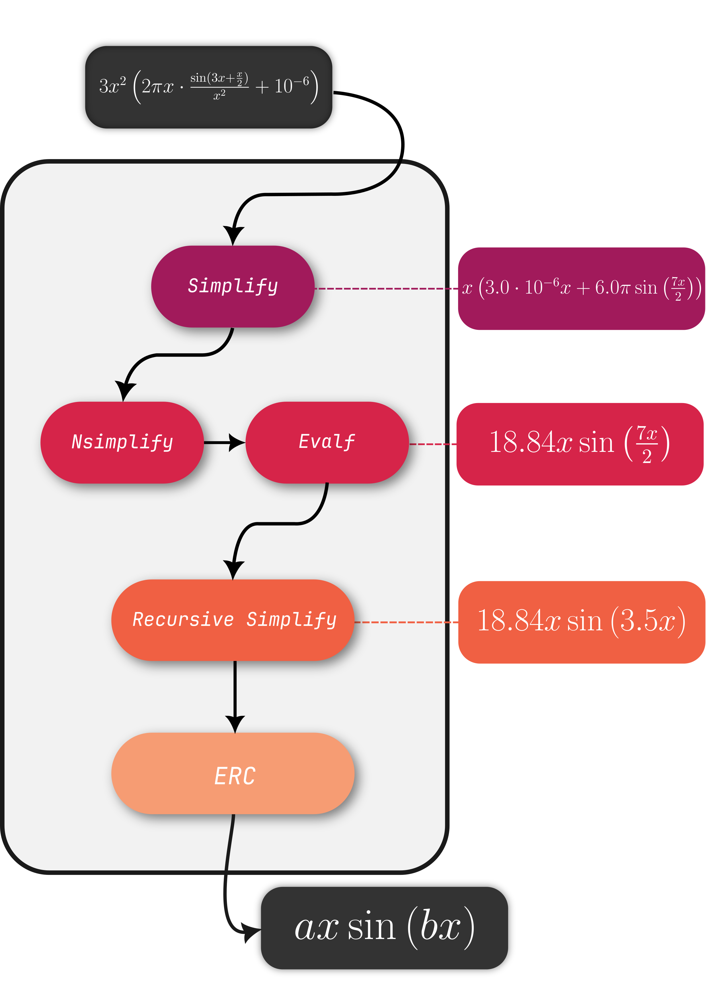

# Benchmarking Symbolic Regression Constant Optimization Schemes

This is the follow-up repository which has been used to write the paper **"Benchmarking Symbolic Regression Constant Optimization Schemes"**, currently on Arxiv, autored by me (L.G.A Reis) and V.L.P.S. Caminha and T.J.P.Penna. 

This repository implements a series of analysis regarding a benchmark done to evaluate the impact different constant optimization techniques have on the accuracy of molling power of Symbolic Regression models. 


## 🧠 About the Project
Symbolic regression (SR) is a machine learning technique that aims to discover symbolic mathematical expressions from data and the field has seen many developemnts a new models in recent times. 

A crucial aspect of SR often overlooked in benchmarking and model development is **constant optimization**—the process of refining the numeric coefficients within symbolic expressions during the search process. This project provides a comprehensive evaluation of **eight different optimization algorithms**, including:
- BFGS  
- Conjugate Gradient (CG)  
- Levenberg–Marquardt (LS)  
- Nelder-Mead  
- Particle Swarm Optimization (PSO)  
- Differential Evolution (DE)  
- Dual Annealing  
- A no-optimization baseline (NoOpt)
All of them were used following scipy's implementation, in order to guarantee a more even field. The only exception to this rule is PSO (which has no scipy implementaion), but further discussion is promoted in the article. 

> We measure both numerical accuracy (MSE, R²) and symbolic accuracy (TED), plus expression complexity. On the later, we have also improved on the use of **Tree Edit Distance (TED)** as a symbolic accuracy metric, allowing deeper insight into how closely a discovered expression matches the true solution and they are distributed in this space.

## 📦 Codebase Overview

This repository contains the benchmarking framework used in the experiments. It builds upon the [CSOWP-SR repository](https://github.com/Guilherme-Ataliba/CSOWP-SR), which provides the core symbolic regression model used as the testing ground for this study.

> The choice to use a custom-built, minimal symbolic regression engine ensures that results reflect the effects of constant optimization alone—without interference from complex heuristics found in state-of-the-art SR libraries. So the analysis here developed should generalize to any GPSR model.

```bash
📂 /benchmarking
├── /algorithms/          # Contains the Symbolic Regression model utilized -  CSOWP-SR
├── /datasets/            # This is where all post-processed data is stored. The raw data is not contained is this repository due to its size.
├── /figures/             # All figures that ended up in the paper and some that didn't make the cut.
└── README.md
``` 

## 📊 Metrics Used
To evaluate the models, we combine both numerical and symbolic metrics:
- MSE (Mean Squared Error) – measures numerical accuracy
- R² (Coefficient of Determination) – standard regression quality measure
- TED (Tree Edit Distance) – evaluates symbolic closeness of expressions
- Expression Size – complexity measured by the number of nodes in the expression tree

## Recursive Simplify
We have developed a custom preprocessing pipeline that ensures consistency in expression comparison, reducing them to a common form, using symbolic simplification and constant abstraction. The absence of a trustworthy simplification algorithm has been discussed in many papers as a potential problem when studying symbolic regression accuracy. Following we show an illustration of the simplification routine, followed by the Python code (that uses sympy). 
- For more detail, one can check its implementation under [preprocessing.py](preprocessing.py) and further discussion on the actual paper.

<div align="center">
  
</div>

```python
def recursive_simplify (expr, precision =15) :
  # If the expr has no args, it is an atom (number or symbol)
  if not expr.args :
    return expr.evalf(precision).simplify()

  # Recursively process all arguments
  simplified_args = [recursive_simplify(arg, precision) for arg in expr.args]

  # Reconstruct expression with simplified arguments
  simplified_expr = expr.func(*simplified_args)

  # Remove and Simplify constants
  return simplified_expr.evalf(precision).simplify()
```


## 🧪 Benchmarking Setup
The benchmark was performed across 10 univariate symbolic regression problems, ranging from easy to hard, with and without specific prior knowledge (basis function restriction). Examples include:
- Logistic Growth
- Radioactive Decay
- Damped Pendulum
- Complex benchmark functions from the Korns dataset

Each optimization method was tested under the same conditions to ensure fair comparison. More than 200,000 evaluations were conducted.

## 📈 Results & Analysis
I highly recommend to read the paper to better understand the nuances and conclusions therein. Nonetheless, here are some analysis and conclusions obtained in the study:

### 
  
## 📚 Citation
If you use this repository in your work, please cite:

@misc{reis2024benchmarking,
  title={Benchmarking Symbolic Regression Constant Optimization Schemes},
  author={L.G.A. dos Reis and V.L.P.S. Caminha and T.J.P. Penna},
  year={2024},
  eprint={2412.02126},
  archivePrefix={arXiv},
  primaryClass={cs.LG}
}

## 🔗 Related Projects
- [CSOWP-SR](https://github.com/Guilherme-Ataliba/CSOWP-Symbolic-Regression): Constant Swarm with Operator Weighted Pruning – The symbolic regression engine used in this benchmark.

## 👨‍💻 Author

Developed by Luiz Guilherme Ataliba dos Reis,
Master’s student in Computational Physics, with a focus on machine learning, symbolic regression, and high-performance computing.
