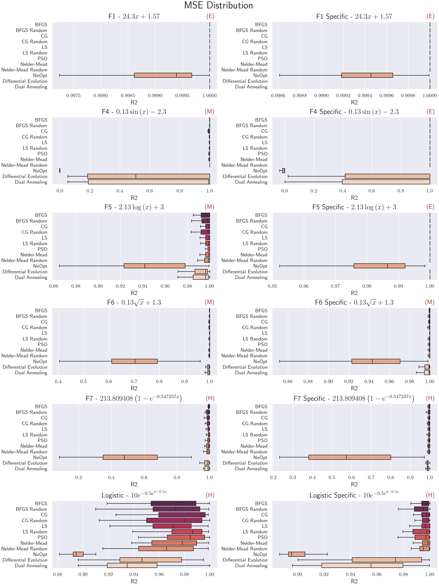
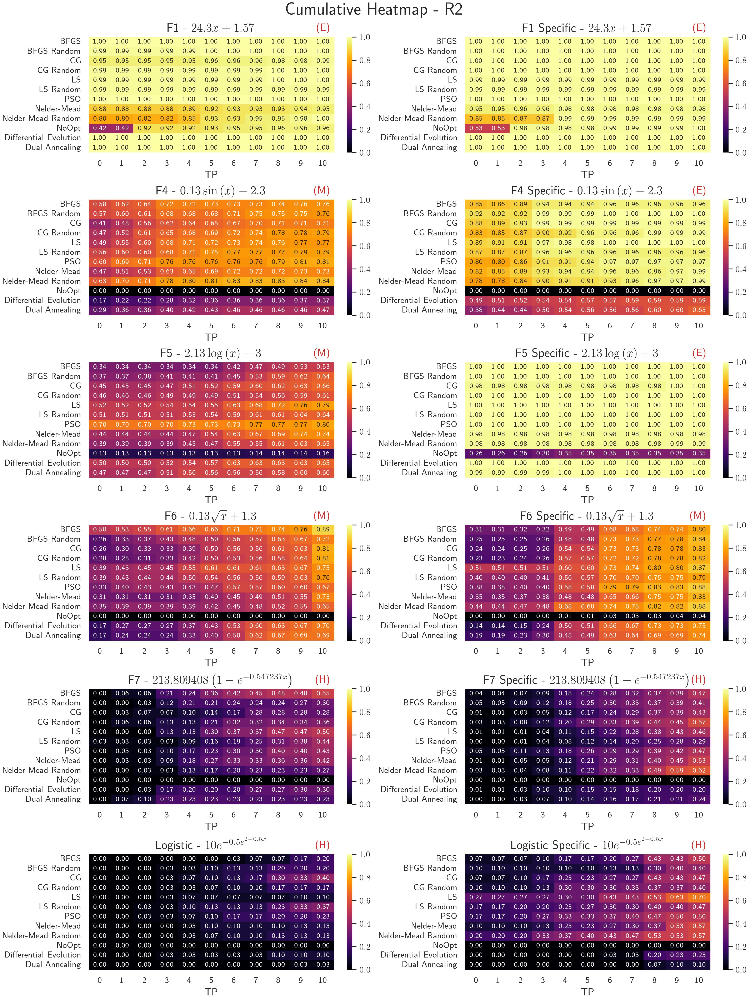

# Benchmarking Symbolic Regression Constant Optimization Schemes

This is the follow-up repository which has been used to write the paper **"Benchmarking Symbolic Regression Constant Optimization Schemes"**, currently on Arxiv, autored by me (L.G.A Reis) and V.L.P.S. Caminha and T.J.P.Penna. 

This repository implements a series of analysis regarding a benchmark done to evaluate the impact different constant optimization techniques have on the accuracy of molling power of Symbolic Regression models. 


## 🧠 About the Project
Symbolic regression (SR) is a machine learning technique that aims to discover symbolic mathematical expressions from data and the field has seen many developemnts a new models in recent times. 

A crucial aspect of SR often overlooked in benchmarking and model development is **constant optimization**—the process of refining the numeric coefficients within symbolic expressions during the search process. This project provides a comprehensive evaluation of **eight different optimization algorithms**, including:
- BFGS  
- Conjugate Gradient (CG)  
- Levenberg–Marquardt (LS)  
- Nelder-Mead  
- Particle Swarm Optimization (PSO)  
- Differential Evolution (DE)  
- Dual Annealing  
- A no-optimization baseline (NoOpt)
All of them were used following scipy's implementation, in order to guarantee a more even field. The only exception to this rule is PSO (which has no scipy implementaion), but further discussion is promoted in the article. 

> We measure both numerical accuracy (MSE, R²) and symbolic accuracy (TED), plus expression complexity. On the later, we have also improved on the use of **Tree Edit Distance (TED)** as a symbolic accuracy metric, allowing deeper insight into how closely a discovered expression matches the true solution and they are distributed in this space.

## 📦 Codebase Overview

This repository contains the benchmarking framework used in the experiments. It builds upon the [CSOWP-SR repository](https://github.com/Guilherme-Ataliba/CSOWP-SR), which provides the core symbolic regression model used as the testing ground for this study.

> The choice to use a custom-built, minimal symbolic regression engine ensures that results reflect the effects of constant optimization alone—without interference from complex heuristics found in state-of-the-art SR libraries. So the analysis here developed should generalize to any GPSR model.

```bash
📂 /benchmarking
├── /algorithms/          # Contains the Symbolic Regression model utilized -  CSOWP-SR
├── /datasets/            # This is where all post-processed data is stored. The raw data is not contained is this repository due to its size.
├── /figures/             # All figures that ended up in the paper and some that didn't make the cut.
└── README.md
``` 

## 📊 Metrics Used
To evaluate the models, we combine both numerical and symbolic metrics:
- MSE (Mean Squared Error) – measures numerical accuracy
- R² (Coefficient of Determination) – standard regression quality measure
- TED (Tree Edit Distance) – evaluates symbolic closeness of expressions
- Expression Size – complexity measured by the number of nodes in the expression tree

## Recursive Simplify
We have developed a custom preprocessing pipeline that ensures consistency in expression comparison, reducing them to a common form, using symbolic simplification and constant abstraction. The absence of a trustworthy simplification algorithm has been discussed in many papers as a potential problem when studying symbolic regression accuracy. Following we show an illustration of the simplification routine, followed by the Python code (that uses sympy). 
- For more detail, one can check its implementation under [preprocessing.py](preprocessing.py) and further discussion on the actual paper.

<div align="center">
  
</div>

```python
def recursive_simplify (expr, precision =15) :
  # If the expr has no args, it is an atom (number or symbol)
  if not expr.args :
    return expr.evalf(precision).simplify()

  # Recursively process all arguments
  simplified_args = [recursive_simplify(arg, precision) for arg in expr.args]

  # Reconstruct expression with simplified arguments
  simplified_expr = expr.func(*simplified_args)

  # Remove and Simplify constants
  return simplified_expr.evalf(precision).simplify()
```


## 🧪 Benchmarking Setup
The benchmark was performed across 10 univariate symbolic regression problems, ranging from easy to hard, with and without specific prior knowledge (basis function restriction). Examples include:
- Logistic Growth
- Radioactive Decay
- Damped Pendulum
- Complex benchmark functions from the Korns dataset

Each optimization method was tested under the same conditions to ensure fair comparison. More than 200,000 evaluations were conducted.

## 📈 Results & Analysis

For a comprehensive understanding of the methodology and key findings, we strongly encourage reading the full [paper](https://arxiv.org/abs/2412.02126). However, some of the core analyses and insights are summarized below to showcase the evaluation process and the behavior of each optimization scheme.

These results highlight not only technical performance, but also reflect skills in experimental design, statistical validation, and metric interpretation—all critical for developing reliable ML systems.

---

### 📉 MSE Distribution
To ensure statistical reliability, each constant optimization strategy was executed dozens of times per test function, until convergence in the result distribution was observed. The plot below shows the **boxplot of MSE values** for each method across all benchmark problems, providing a clear picture of both central tendency and variance.

<div align="center">
  
</div>

This analysis demonstrates:
- The **consistency** and **robustness** of certain optimizers (e.g., BFGS, PSO)  
- How some methods present wider variance, suggesting less reliable convergence  
- A well-structured benchmarking pipeline, able to handle high-throughput experimentation

---

### 🔥 R² Cumulative Heatmap - 2-fold Metric Analysis

To explore the relationship between symbolic and numerical performance, we analyzed how often each model achieved a high **R² score**, a standard measure of explained variance. This heatmap shows the **cumulative success rate** of each optimizer as the threshold increases.

<div align="center">
  
</div>

Highlights:
- Evaluating **R² alongside TED** allows a richer, multi-dimensional understanding of model quality  
- Some optimizers, while numerically strong, fail to produce interpretable or symbolic matches  
- This kind of dual-metric insight is valuable when designing systems that must be both accurate and explainable  

---

These analyses underscore an important lesson in machine learning: strong numerical results do not guarantee meaningful or interpretable models. The framework built for this benchmark reflects a deliberate focus on **evaluating trade-offs**, **validating assumptions**, and **communicating results with clarity**—skills crucial for real-world data science roles.

  
## 📚 Citation
If you use this repository in your work, please cite:

@misc{reis2024benchmarking,
  title={Benchmarking Symbolic Regression Constant Optimization Schemes},
  author={L.G.A. dos Reis and V.L.P.S. Caminha and T.J.P. Penna},
  year={2024},
  eprint={2412.02126},
  archivePrefix={arXiv},
  primaryClass={cs.LG}
}

## 🔗 Related Projects
- [CSOWP-SR](https://github.com/Guilherme-Ataliba/CSOWP-Symbolic-Regression): Constant Swarm with Operator Weighted Pruning – The symbolic regression engine used in this benchmark.

## 👨‍💻 Author

Developed by Luiz Guilherme Ataliba dos Reis, Master’s student in Computational Physics, with a focus on machine learning, symbolic regression, and high-performance computing.
For more, visit [LinkedIn](www.linkedin.com/in/guilherme-ataliba) or follow updates
